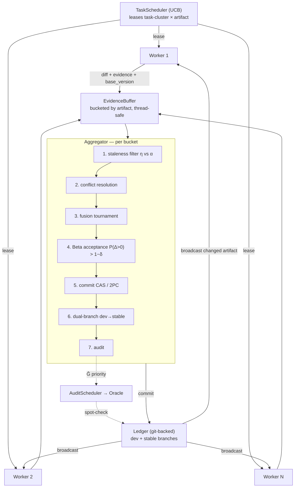

# Architecture

This document explains how AgentDescent's components fit together and how a diff
travels from a worker to a committed change in the shared artifact library.

For the *why* behind each mechanism see [concepts.md](concepts.md); for how to
run and extend the system see [usage.md](usage.md).

---

## 1. The one-paragraph model

AgentDescent runs **N workers in parallel**. Each worker takes a snapshot of a
shared, versioned **artifact library** (the `Ledger`), runs tasks against it,
and emits a **diff + evidence card** (a "gradient"). A single **Aggregator**
(the "optimizer") collects these diffs per-artifact, resolves conflicts, fuses
complementary ones, accepts them by a statistical test, and commits the winner
back to the Ledger — which is then broadcast to workers. Everything else
(schedulers, verifier, governance) exists to make that loop fast, safe, and
resistant to the three long tails.

---

## 2. Data flow



The same flow, with the design-doc section numbers annotated:

```
                ┌──────────────────────────────────────────────┐
                │            TaskScheduler (UCB)                │  §5.2
                │   leases (task-cluster × artifact) to workers │
                └───────────────┬──────────────────────────────┘
                     lease tasks │
        ┌─────────────┬──────────┴────────┬─────────────┐
        ▼             ▼                    ▼             ▼
   Worker 1      Worker 2       ...     Worker N      each holds a Ledger
   rollout+      rollout+               rollout+      snapshot  V_i  (may lag
   propose       propose                propose       head → staleness η)
        │             │                    │             │
        └──── Diff + EvidenceCard + base_version ─────────┘
                              │
                              ▼
                  EvidenceBuffer  (bucketed by artifact, thread-safe)   §4.1
                              │
                              ▼
        ┌─────────────────────────────────────────────────────┐
        │                 Aggregator  (per bucket)             │  §4
        │  1. staleness filter   η vs α  → ACCEPT/REBASE/DISCARD│  §4.2
        │  2. conflict resolve   contradictions dropped         │  §4.3
        │  3. fusion tournament  complementary diffs merged     │  §4.3
        │  4. Beta acceptance    P(Δ>0) > 1−δ                    │  §4.4
        │  5. commit             CAS / 2PC                       │  §4.1
        │  6. dual-branch        dev → stable (EMA)              │  §4.5
        │  7. audit              submit merge to AuditScheduler  │  §5.3
        └───────────────────────────┬─────────────────────────┘
                                     ▼
                    Ledger  (git-backed, version-vectored)         §3.1
                     dev branch (fast)   stable branch (EMA-confirmed)
                                     │
                    broadcast changed artifact → Workers refresh
                                     │
                    AuditScheduler (Ĝ) → Oracle spot-checks         §5.3
```

The three-layer **verifier** (rule / learned / oracle) is the evaluation backend
the Aggregator calls at steps 1–4 (cheap) and step 7 (oracle, budgeted).

---

## 3. Component responsibilities

| Component | Module | Responsibility |
|---|---|---|
| **Evolvable** | [`evolvable.py`](https://github.com/Birfy/agentdescent/blob/main/agentdescent/evolvable.py) | The interface every unit of evolution implements (`diff`/`apply`/`cheap_eval`/`full_eval`). Also `Diff`, `EvidenceCard`, version-vector math. |
| **Ledger** | [`ledger.py`](https://github.com/Birfy/agentdescent/blob/main/agentdescent/ledger.py) | Git-backed store. Per-artifact integer versions form the version vector. CAS commits, 2PC atomic multi-artifact commits, `dev`/`stable` branches. |
| **Aggregator** | [`aggregator.py`](https://github.com/Birfy/agentdescent/blob/main/agentdescent/aggregator.py) | The optimizer. Buckets evidence by artifact and runs the 7-step merge pipeline. Owns the per-artifact Beta posteriors. |
| **StalenessPolicy** | [`staleness.py`](https://github.com/Birfy/agentdescent/blob/main/agentdescent/staleness.py) | Full / Guarded / Reflective. Decides `ACCEPT/REBASE/DISCARD` for a stale diff. Swappable without touching the pipeline. |
| **Verifier** | [`verifier.py`](https://github.com/Birfy/agentdescent/blob/main/agentdescent/verifier.py) | rule (cheap subset), learned (noisy + uncertainty), oracle (ground truth, budgeted). |
| **Schedulers** | [`scheduler.py`](https://github.com/Birfy/agentdescent/blob/main/agentdescent/scheduler.py) | `TaskScheduler` (UCB task leasing), `AuditScheduler` (oracle-budget allocation + trust), `ResumeQueue` (partial-rollout checkpoints). |
| **Governance** | [`governance.py`](https://github.com/Birfy/agentdescent/blob/main/agentdescent/governance.py) | Sorts artifacts into L0/L1/L2 by blast radius; L0 is read-only to the loop; L1 serial gate. |
| **Worker** | [`worker.py`](https://github.com/Birfy/agentdescent/blob/main/agentdescent/worker.py) | rollout + propose. Emits evidence cards; never mutates the Ledger directly. |
| **Sync runtime** | [`orchestrator.py`](https://github.com/Birfy/agentdescent/blob/main/agentdescent/orchestrator.py) | `AgentDescent`: round-barrier DP loop + fork baseline. |
| **Async runtime** | [`async_runtime.py`](https://github.com/Birfy/agentdescent/blob/main/agentdescent/async_runtime.py) | `AsyncAgentDescent`: barrier-free thread pipeline + `async_ratio` + backpressure. |
| **Parallel paradigms** | [`parallel.py`](https://github.com/Birfy/agentdescent/blob/main/agentdescent/parallel.py) | DP / TP / PP partition & recombine primitives. |
| **Reference domain** | [`domains/router.py`](https://github.com/Birfy/agentdescent/blob/main/agentdescent/domains/router.py) | A deterministic keyword-router skill so the whole loop runs with no LLM. |

---

## 4. The two runtimes

!!! warning "Two stacks — know which one you are reading about"
    The data-flow diagram above (`TaskScheduler` → `Worker` → `EvidenceBuffer`)
    describes the **reference stage-orchestration stack**:
    [`AgentDescent`](https://github.com/Birfy/agentdescent/blob/main/agentdescent/orchestrator.py)
    and [`AsyncAgentDescent`](https://github.com/Birfy/agentdescent/blob/main/agentdescent/async_runtime.py),
    used by `run_demo`, `run_async`, `efficiency`, `duration_scheduling` and
    `rq2_staleness`.

    The **general engine** — [`evolve()` / `async_evolve()`](evolution.md), the
    documented entry point that every algorithm port uses — shares the `Ledger`,
    `Aggregator`, staleness policies, governance and `AuditScheduler`, but **not**
    the `TaskScheduler`, `EvidenceBuffer`, `ResumeQueue` or `DurationEstimator`.
    It does its own sharding, keeps its own intake buffer, and selects tasks via a
    [`task_sampler`](evolution.md#task-selection-which-rollout-to-spend).

    So two capabilities described below are, today, reachable **only** through the
    reference stack: UCB task-cluster leasing (§5.2 / L-task) and partial-rollout
    resume (§5.1 / L-traj). `evolve()`'s `task_sampler` covers the L-task idea at
    task granularity; there is no `evolve()`-level resume yet. This split is a
    known wart, not a design intent — it is tracked for consolidation.

AgentDescent separates *what to merge* (the Aggregator, identical in both) from
*when workers and the aggregator run relative to each other* (the runtime).

### 4.1 Synchronous DP — `AgentDescent` (orchestrator.py)

A round barrier:

```
for round in range(R):
    leases = scheduler.select_batch(n_workers)   # distinct clusters
    for worker, cluster in zip(workers, leases):
        card = worker.run(snapshot, base_version, cluster.tasks)
        aggregator.ingest(card)
    aggregator.step()                            # <-- barrier: one sweep per round
```

Deterministic and easy to reason about. Used for the RQ1 (merge-vs-fork) and
RQ2 (staleness sweep) experiments.

### 4.2 Asynchronous stage orchestration — `AsyncAgentDescent` (async_runtime.py)

No barrier. Threads run independently:

```
 worker thread (× N)                    aggregator thread (× 1)
 ──────────────────                     ───────────────────────
 loop:                                  loop:
   if drift > async_ratio: refresh        reports = aggregator.step()
   cluster = lease_round_robin()          update published head on commit
   card = worker.run(...)                 sample accuracy
   aggregator.ingest(card)                if stalled: bump refresh epoch
```

Connected only through the thread-safe `EvidenceBuffer`. The rollout/propose and
aggregate/commit **stages overlap** — a worker keeps proposing while the
aggregator is still merging the previous batch.

---

## 5. Concurrency & correctness

Because the reference runtime uses in-process threads, shared state is guarded
explicitly:

- **Ledger** — an `RLock` serializes all git operations; **CAS** is what makes
  the *logical* concurrency safe (a commit whose declared base version is stale
  is rejected, forcing a rebase).
- **EvidenceBuffer** — an internal lock guards the per-artifact buckets so many
  worker threads can `add()` while the aggregator thread `drain()`s.
- **TaskScheduler** — a lock guards UCB state so concurrent `lease_*` / `record`
  calls don't race.
- **Verifier / posteriors** — touched only by the single aggregator thread, so
  they need no locking.

The GIL means threads don't give true CPU parallelism, but the **pipeline
overlap** and every concurrency-control mechanism (CAS, version vectors,
per-diff staleness, backpressure) are real — the same code shape drives a
genuinely parallel process or multi-host pool.

---

## 6. Version vectors & staleness in one picture

```
head (dev):     {mol-router: 7}
worker A base:  {mol-router: 7}   → η = 0   → ACCEPT
worker B base:  {mol-router: 5}   → η = 2   → REBASE (if η ≤ α) or DISCARD
worker C base:  {mol-router: 1}   → η = 6   → DISCARD (Guarded) / REBASE (Reflective)
```

`η(d) = max over touched artifacts (head_version − base_version)`. The active
`StalenessPolicy` maps `(η, α, contract_breaking)` to an action; `async_ratio`
(async runtime only) bounds how large η is allowed to grow before a worker is
forced to refresh. See [concepts.md §3](concepts.md#3-staleness) for the full
treatment.
