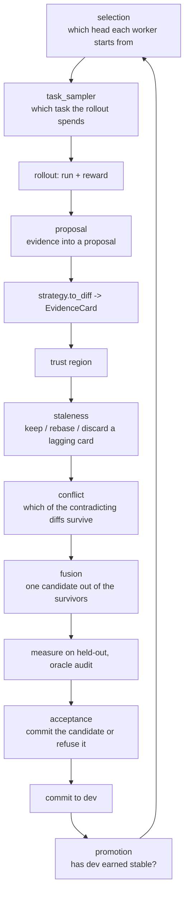

# Using the policy slots — a systematic guide

*Companion to:* [Choosing policies](policies.md) (the catalogue of what ships)
· [The aggregator](aggregator.md) (the pipeline the slots sit in)

[`policies.md`](policies.md) lists the slots and what fills them. This page
is the *how*: where each slot sits in a round, what it is handed and what it
must give back, how slots compose, the three ways to fill one, how to write
one that the engine will actually honour, and how to prove it ran. Read it
once before writing a policy; come back to §4 while writing one.

## 1. Where each slot sits

One round of `evolve()` is a loop of rollouts feeding one merge. The eight
algorithm slots sit at fixed points of that loop, and nothing else in the
engine is a decision you can swap — everything between the boxes is
machinery.



| Slot | Runs | Is handed | Must return | Default |
|---|---|---|---|---|
| `selection` | once per merge, before the next batch | `SelectionContext` (head, every candidate, round, `n_workers`) | up to `n` `Candidate`s; repeats mean "put more workers here" | `SingleHead` |
| `task_sampler` | once per rollout | the worker's task ids, the round index | one id from those ids; later told the score | `RoundRobin` |
| `proposal` | once per rollout, after reward | `ProposalContext` (rendered artifact, task, output, reward) | zero or one proposal string | the actor's `propose` |
| `staleness` | once per card at merge | `eta` (versions behind), `alpha` (tolerance), `contract_breaking` | a `StaleAction` | `Guarded` |
| `conflict` | once per merge | the artifact, the surviving cards | `(kept_cards, dropped_count)` | `DefaultConflict` |
| `fusion` | once per merge | the artifact, the kept diffs | `(chosen_diff, candidate_artifact, fused: bool)` | `DefaultFusion` |
| `acceptance` | once per candidate | `MergeContext` (both measurements, prior, distance to stable) | `AcceptDecision` | `DefaultAcceptance` |
| `promotion` | once per `step()`, after every artifact's report | this step's `MergeReport`s | `Promotion`s for `stable` | `DefaultPromotion` |

Three points on the diagram are worth fixing in mind. **Conflict runs before
fusion**, so a fusion policy only ever sees what the conflict policy let
through — that is why model merging is a pair of slots, not one. **Acceptance
runs after measurement**, so it never measures anything; it reads numbers. And
**promotion sees reports, not artifacts**: it decides from what happened this
step, and artifacts nobody touched still age (see §4).

## 2. How slots compose

Five rules, and every one of them is enforced rather than documented.

1. **Empty means today.** Each field is `None` by default and `None` is the
   shipped behaviour, so `Policies()` and passing nothing are the same run,
   and filling one slot leaves the other seven untouched. Fill exactly the
   slots your mechanism is about.
2. **One pair.** `conflict` and `fusion` are the only two that must agree:
   `ReflectiveFusion` merges contradictions, and the default conflict rule
   throws contradictions away one step earlier. `reflective_merge(completion)`
   returns both so the half-installed version is not available to you. Every
   other combination is orthogonal.
3. **One seat, one occupant.** `selection` installs the population aggregator
   and `aggregator_factory` replaces the aggregator, so passing both raises.
   A factory-built aggregator also does not see `conflict`, `fusion`,
   `acceptance` or `promotion` from the bundle — pass those into your
   aggregator's constructor and drop them from the bundle; the engine warns
   if you leave them in ([the factory exit](aggregator-factory.md)).
4. **Nothing is silently ignored.** Each driver declares the fields it
   honours and `Policies.require_supported` raises on the rest. Today that
   means `sandbox_provider` is refused everywhere and `executor` is refused
   by `async_evolve()` — a policy that installs but does not run is the one
   failure a caller cannot detect, so it is made impossible.
5. **The old keyword arguments are shortcuts.** `task_sampler=`,
   `staleness_policy=` and `aggregator_factory=` on `evolve()` fold into the
   bundle, and an explicit argument beats a bundle default. Use one spelling
   per call site.

## 3. Three ways to fill a slot

**Pick a shipped implementation.** The tables on each slot's page. Nothing
to write:

```python
from agentdescent import Policies, evolve
from agentdescent.selection import Beam
from agentdescent.sampling import DifficultyWeighted

evolve(tasks, reward, agent=agent,
       policies=Policies(selection=Beam(4), task_sampler=DifficultyWeighted()))
```

**Wrap the default.** When your idea is *one extra term* on a decision the
shipped rule already makes well, wrap it rather than replacing it — the
regression guard, the seeded Beta draw and the reset semantics all have a
history, and a replacement is how a codebase forgets what it paid to learn.
The shipped wrappers (`AdvantageAcceptance`, `StableDistanceAcceptance`,
`AdvantageConflict`) default their `inner` to the shipped rule and forward the
install hooks (§5), so they need nothing from you:

```python
from agentdescent.advantage import AdvantageAcceptance, AdvantageConflict

evolve(tasks, reward, agent=agent, policies=Policies(
    acceptance=AdvantageAcceptance(strength=1.0),   # shipped gate + a prior shift
    conflict=AdvantageConflict(margin=0.5),         # shipped rule + a tie-break
))
```

Writing your own wrapper is the same shape: hold `inner`, add the term,
defer for everything else, and forward `bind` / `configure` (copy the
five-line pattern from `agentdescent.advantage`).

**Replace it.** When the decision *rule* is different — a strict-improvement
gate, a curriculum sampler, a tree-search selection — write an object with
the slot's method (§4) and pass it. The contracts are `typing.Protocol`s, so
there is nothing to inherit from; the method name and signature are the
whole contract, and `tests/test_policy_contract.py` re-derives them from the
engine's call sites so they cannot drift from what actually runs.

Which of the three: shipped if it exists; wrap if the default's guards should
survive; replace if they should not. When the mechanism needs *state the
pipeline does not keep* — an archive, per-instance score rows, a pool with its
own admission rule — none of the three fits, and the
[`aggregator_factory`](aggregator-factory.md) exit is the answer.

## 4. Writing a policy: the contract for each slot

Everything below is what the engine actually calls; the module docstring of
`agentdescent/policies.py` explains why the contracts were written from the
call sites rather than the docs. Each entry names the method, what it may
rely on, and the one thing that goes wrong most.

### `task_sampler` — `pick(keys, round_index) -> str`, `record(task_id, score)`

Return one id from `keys`; never mutate `keys`. `record` arrives after the
rollout with the reward in `[0, 1]`, and is your only learning signal. Under
data parallelism `keys` is *this worker's shard*, so a sampler that assumes
it sees every task will mis-weight. Page: [task sampling](sampling.md).

### `selection` — `select(ctx, n) -> Sequence[Candidate]`

`ctx.head` is what the engine would have used with no policy; return
`[ctx.head] * n` when you have no reason to do otherwise. Return fewer than
`n` and the engine assigns round-robin; return repeats to weight a point.
`Candidate.score is None` means *unmeasured*, not zero — ranking it last is
how a fresh branch never gets tried. Declaring any policy other than
`SingleHead` installs the population layer that keeps an archive of committed
heads for you; you do not build it. Page: [candidate selection](selection.md).

### `proposal` — `propose(ctx) -> Sequence[str]`

Zero or one string. Returning `[]` skips the rollout's proposal cleanly.
Returning two or more raises `ProposalContractError` rather than keeping the
first: the engine turns one proposal into one diff, and truncating would make
a k-sampling algorithm look like it ran. `ctx.history` and `ctx.k` exist for
the day batched rollouts land; today they are empty and `1`. Page:
[proposal policies](proposal-policies.md).

### `staleness` — `decide(eta, alpha, contract_breaking) -> StaleAction`

Declare a `name`. `ACCEPT` takes the diff as-is (rebased mechanically when
`eta > 0`), `REBASE` rebases and cheaply re-verifies, `DISCARD` settles the
card's evidence back to the pool. `alpha` is already the tolerance for this
artifact's governance layer; you decide, the aggregator executes. Page:
[staleness policies](staleness.md).

### `conflict` — `resolve(artifact, cards) -> (kept, dropped)`

Two diffs contradict when they write one key with different values. Keep
going after a win: a card that displaces one survivor may contradict another,
and stopping at the first left mutually contradicting cards for fusion to
choke on. `dropped` is a count, reported as `conflicts_dropped`. **Keep at
least one card**: the fusion step is handed whatever you kept and indexes into
it, so a policy that empties the batch fails there, not here — drop losers,
never the whole round. To *score* a tie you need the verifier's `cheap_eval`
— which you cannot construct, so take it through `bind` (§5). Page:
[conflict policies](conflict-policies.md).

### `fusion` — `select(artifact, diffs) -> (diff, candidate, fused)`

Given the kept diffs, return the one diff that goes to the gate, the artifact
with it applied, and whether it is a union. `fuse_diffs` in
`agentdescent.aggregator` builds a union for you; contradictions must be gone
by now or the union is ill-defined. Optionally keep a `trials` list of
`FusionTrial`s and the engine carries it onto `result.fusion_trials` — leave
it out and `fusion_stats()` reports "not instrumented" rather than "never
won". Ranking needs the verifier: `bind`. Page:
[fusion policies](fusion-policies.md).

### `acceptance` — `accept(ctx: MergeContext) -> AcceptDecision`

The one contract with a rule that has already been broken once, so it is the
one to read twice. **Decide from `base_counts` / `cand_counts`** — the full
held-out measurement as `(successes, failures)` — **never from `base_cheap` /
`cand_cheap`**, which are a sub-sample meant for ranking. `ctx.prior` is the
artifact's running posterior; do not mutate it, return a new one through
`dataclasses.replace` as the wrappers do. `category` on a refusal must be a
`MergeOutcome` value (`"below-threshold"` is the ordinary one) — it is what
`result.outcomes()` reports and the aggregator converts it with
`MergeOutcome(...)`, so a made-up string raises. Carry `p_improve` and
`observed_delta` out: the draw is sampled, so recomputing gives a different
number than the one that decided, and a refused candidate's `observed_delta`
is folded back into the prior. Page: [acceptance policies](acceptance-policies.md).

### `promotion` — `observe(reports) -> Sequence[Promotion]`

Called once per `step()` with every artifact's report for that step. Any id
you return is copied from `dev` onto `stable`. Two things the default does
that a replacement must decide about: a commit and an oracle rejection both
*reset* an artifact's survival clock, and an artifact absent from this step's
reports still *ages* — not being touched is the ordinary way to survive a
round. An optional `survival` mapping is picked up for diagnostics. Page:
[promotion policies](promotion-policies.md).

## 5. Installing: what the engine hands your policy

Two things a policy may need are built inside the engine and cannot be
constructed by a caller: the **verifier** (for anything that ranks) and the
**`AggregatorConfig`** (for anything that reads a threshold). When the
aggregator installs a merge-side policy it offers both, through two optional
methods:

| Hook | Offered to | Use it for |
|---|---|---|
| `bind(verifier)` | conflict, fusion, acceptance, promotion | `verifier.cheap_eval(...)` to rank, `eval_counts(...)` to measure |
| `configure(config)` | the same four | `base_delta`, `promote_after_k`, `trust_region_*` — the run's numbers, not a copy |

Neither is required; a policy with neither is left alone. A wrapper forwards
both to its `inner`. A shipped default that is *driven by hand* without ever
being installed raises `PolicyUnboundError` naming the missing piece; in a
test, `install_policy(policy, verifier, config)` from
`agentdescent.aggregator` does what the aggregator would.

Two consequences worth stating. Values you pass explicitly are never
overwritten — `DefaultAcceptance(base_delta=0.3)` keeps `0.3` and takes the
other two thresholds from the run. And a policy is installed *once per
aggregator*, so a policy object carries state across every merge of the run;
build a fresh one per `evolve()` call rather than sharing an instance across
runs.

## 6. Proving the policy ran

A policy that installs and is never consulted is indistinguishable from one
that works, so the first test of any new policy is a counter. This is
runnable as written — no credentials, one second:

```python
from agentdescent import AppendRules, Policies, Task, evolve
from agentdescent.policies import AcceptDecision

tasks = [Task(id=f"t{i}", prompt="q", meta={"gold": f"t{i}"}) for i in range(8)]
reward = lambda task, output: 1.0 if output == task.meta["gold"] else 0.0
run = lambda rendered, task: task.meta["gold"] if task.id in rendered else "?"
propose = lambda rendered, task, output, score: task.id


class RefuseEverything:
    calls = 0

    def accept(self, ctx):
        RefuseEverything.calls += 1
        return AcceptDecision(False, "below-threshold", "refused for the demo",
                              p_improve=0.0,
                              observed_delta=ctx.rate(ctx.cand_counts) - ctx.rate(ctx.base_counts))


result = evolve(tasks, reward, run=run, propose=propose, strategy=AppendRules(),
                rounds=3, n_workers=2, held_out_frac=0.5, seed=0,
                policies=Policies(acceptance=RefuseEverything()))

assert RefuseEverything.calls > 0, "the gate was never consulted"
assert result.outcomes() == {"below-threshold": RefuseEverything.calls}
```

Then the three checks that catch what a counter cannot:

- **`result.outcomes()`** is the vocabulary of what happened at the gate.
  `committed`, `below-threshold`, `all-stale`, `oversized`,
  `oracle-rejected`, `cas-conflict` — each names a different stage, so a
  policy at one stage shows up under one key: a staleness policy that
  discards shows as `all-stale`, a gate that refuses as `below-threshold`,
  and a conflict policy only ever moves `conflicts_dropped` on the reports.
- **A paired baseline run.** Same tasks, same `seed`, `Policies()` — then
  diff `result.history`. The empty bundle *is* the default run, so any
  difference is your policy. `tests/test_policy_contract.py` uses exactly this
  to prove the seams are load-bearing.
- **`result.fusion_stats()`** for a fusion policy, and the `trials` list it
  summarises; for a selection policy, the `population-select` key in
  `outcomes()` says the population layer was installed at all.

## 7. Recipes

| I want to… | Slot | Start from |
|---|---|---|
| spend rollouts where the reward is informative | `task_sampler` | `DifficultyWeighted()` |
| keep several heads and pick the best | `selection` | `Beam(k)`, `ParetoFrontier`, `Archive`, `MCTS` |
| propose only when a rollout was bad | `proposal` | write one: return `[]` above a reward threshold |
| tolerate or reject lagging workers | `staleness` | `get_policy("full" / "guarded" / "reflective")` |
| break ties by group-relative advantage | `conflict` | `AdvantageConflict()` |
| merge contradicting text with a model | `conflict` + `fusion` | `**reflective_merge(completion)` |
| rank singles against their union first | `fusion` | `DefaultFusion(tournament=True)` |
| raise or lower the commit bar | `acceptance` | `agg_config=AggregatorConfig(base_delta=…)` — not a policy |
| add a term to the shipped gate | `acceptance` | `AdvantageAcceptance()`, `StableDistanceAcceptance()` |
| commit only strict full-held-out improvement | `acceptance` | replace: `examples/skillopt` `StrictImprovement` |
| never reach `stable`, or reach it on a schedule | `promotion` | replace: `observe` returning `[]` or your rule |
| a pool with its own admission rule | none | [`aggregator_factory`](aggregator-factory.md) |

The `acceptance` row that says "not a policy" is the general rule: a
*threshold* is a config field, a *rule* is a policy. Change numbers in
`AggregatorConfig`; change decisions in `Policies`.

## 8. Pitfalls, in the order people meet them

1. **Passing the thresholds by hand.** `AdvantageAcceptance(DefaultAcceptance(0.5, 64, 4000))`
   works and silently disagrees with `agg_config=` the day one changes. Leave
   `inner` unset, or use `DefaultAcceptance.from_config(cfg)` when you mean to pin it.
2. **Reading the cheap layer to decide.** `base_cheap` / `cand_cheap` rank;
   `base_counts` / `cand_counts` decide. The field names are different on
   purpose.
3. **A category outside `MergeOutcome`.** `AcceptDecision(False, "nope")`
   raises at the aggregator. Use `"below-threshold"` unless you are reporting
   one of the other named stages.
4. **Installing `ReflectiveFusion` alone.** It is handed one diff and
   correctly declines. Install the pair.
5. **A selection policy and a factory.** Refused together. The factory does
   its own selecting, or the policy runs on the shipped pipeline; choose.
6. **Merge-side policies alongside a factory.** Warned, then ignored. Pass
   them into your aggregator's constructor instead.
7. **`executor` on `async_evolve()`.** Refused rather than dropped; the
   barrier-free loop has no executor seam yet.
8. **Sharing one policy instance across runs.** It keeps per-run state
   (survival counters, posteriors it shifted, trials). One instance per call.
9. **Returning two proposals.** `ProposalContractError`, not truncation.
10. **A `DefaultConflict` driven by hand in a test.** `PolicyUnboundError` on
    the first contradiction: call `bind(verifier)` or `install_policy(...)`
    first. The aggregator does this for you in a real run.
